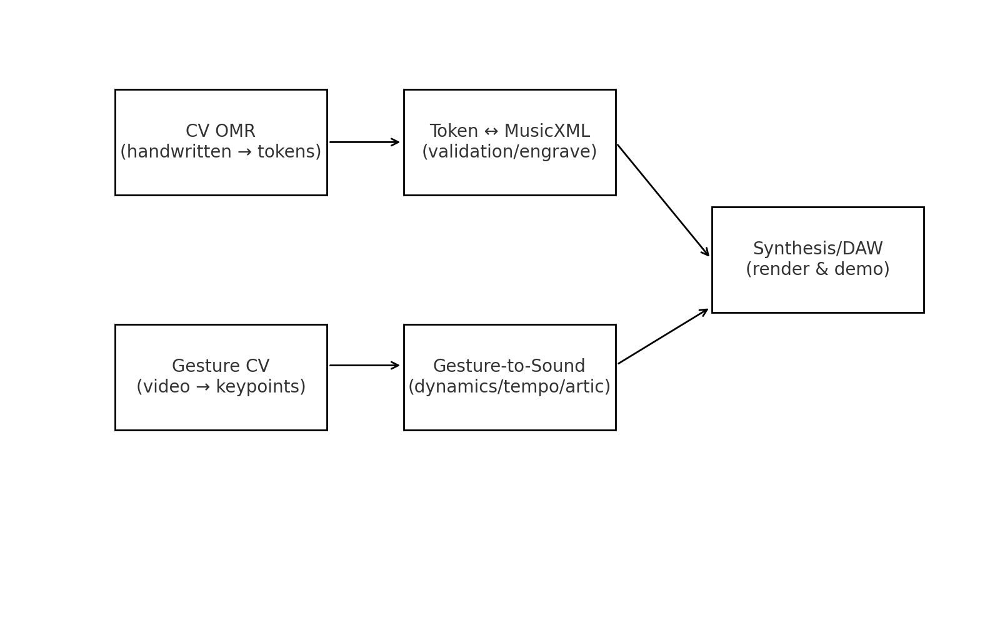

Beethoven AI: Final Symphony explores the frontier where computer science, musicology, and creativity converge.

# 🎼 Beethoven AI: Final Symphony  

*A groundbreaking project merging Beethoven’s timeless genius with modern AI technology to redefine symphonic composition.*

---

## 📖 Overview
**Beethoven AI: Final Symphony** explores the frontier where computer science, musicology, and creativity converge.  
The project applies five AI-driven pillars of orchestration, mapped to Beethoven’s style and spirit:

- **🎼 Computer Vision (CV):** analyzing manuscripts, scores, and digital archives to extract phrasing, dynamics, and thematic nuance.  
- **🤖 Machine Learning (ML):** training authenticity models to safeguard harmonic language, rhythm, and stylistic depth aligned with Beethoven’s ethos.  
- **🎮 Game-Theory:** enabling real-time co-creation loops where AI and humans dynamically collaborate on symphonic development.  
- **⚙️ Robotic Process Automation (RPA):** orchestrating workflows for rehearsal prep, part extraction, and scheduling – scaling production while preserving quality.  
- **📊 Algorithms & OOP:** recursive structures and object-oriented programming to model rhythmic complexity, counterpoint, and metric modulation.  

This fusion ensures compositions that are **rigorous, emotionally resonant, and stylistically authentic.**

---

## 🛠 Tech Stack
- **Languages:** Python, R, C++, Swift, Julia  
- **Frameworks:** TensorFlow, PyTorch, OpenCV, SwiftUI  
- **Automation:** UiPath, Automation Anywhere for orchestration workflows  
- **Collaboration:** GitHub Actions, pre-commit hooks, RPA pipelines  

---

## 📂 Repo Structure
\`\`\`plaintext
/design-system/     # Shared UI + orchestration components  
/core-logic/        # Reusable pipelines, helpers, adapters  
/governance/        # CODE_OF_CONDUCT, policies, templates  
/dashboards/        # Metrics, heatmaps, status boards  
/examples/          # Minimal compositions + test fragments  
\`\`\`

---

## 🌐 Role in the Ecosystem
This repo anchors the **Carnegie Hall flagship orchestration framework**, linking technical innovation with artistic authenticity. It:

- Connects to *mirror repos* (Disney AI, NASA Orbital Symphony, Paramount, Netflix, etc.)  
- Demonstrates orchestration across **Carnegie Hall’s Five Pillars**  
- Acts as a testbed for **human–AI collaboration** in creative domains  
- Bridges **music, data science, and automation** into one unified framework  

---

## ✨ Features
- **🎼 Score Analysis via CV:** extract dynamic shifts, motifs, and phrasing subtleties.  
- **🤖 ML Authenticity Models:** ensure harmonic and rhythmic authenticity.  
- **🎮 Game-Theory Collaboration:** real-time co-creation of musical passages.  
- **📊 Governance Dashboards:** orchestration health, motif tracking, project metrics.  
- **⚙️ Automated Orchestration:** RPA-powered part prep, scheduling, rehearsal support.  

---

## ⚡ Quick Start
Clone this repo and install dependencies:

\`\`\`bash
git clone https://github.com/pshivch/beethoven-ai-final-symphony.git
cd beethoven-ai-final-symphony
pip install -r requirements.txt
jupyter notebook
\`\`\`

---

## 🗺 Roadmap
- [ ] Upload sample CV notebooks for score/style analysis  
- [ ] Release ML models trained on Beethoven’s repertoire  
- [ ] Prototype interactive game-theory co-creation loop  
- [ ] Automate orchestration workflows via RPA scripts  
- [ ] Generate demo symphonic fragments + final showcase performance  

---

## 🎵 Inspiration
Beethoven’s unfinished sketches represent **artistic genius halted by mortality.**  
This project asks: *what if AI could help finish the symphony?*  

It’s not just about generating notes – it’s about:  
- Honoring Beethoven’s spirit through **stylistically authentic AI tools**  
- Creating a **testbed for human–AI co-creation**  
- Showing how **computer science + musicology** can merge into new symphonic forms  

---

## 📜 License
MIT License – free to use, remix, and extend. Contributions welcome.
## 📓 Notebooks
- [01_OMR_demo.ipynb](01_OMR_demo.ipynb) — handwritten score → tokens → MusicXML round-trip.
- [02_Gesture_demo.ipynb](02_Gesture_demo.ipynb) — conductor gestures → keypoints → real-time dynamics.
## 📓 Notebooks  

  
**01_OMR_demo.ipynb** — handwritten score → tokens → MusicXML round-trip.  

  
**02_Gesture_demo.ipynb** — conductor gestures → keypoints → real-time dynamics.  

